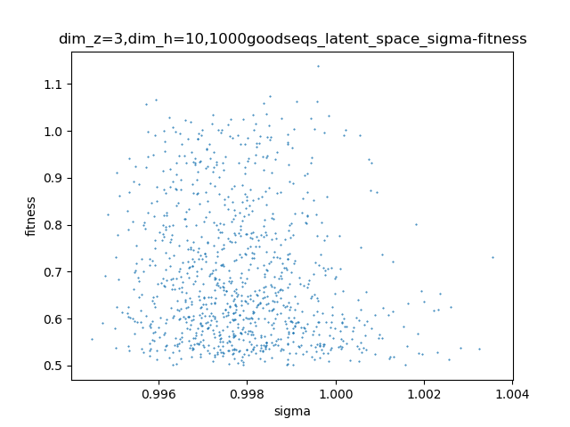
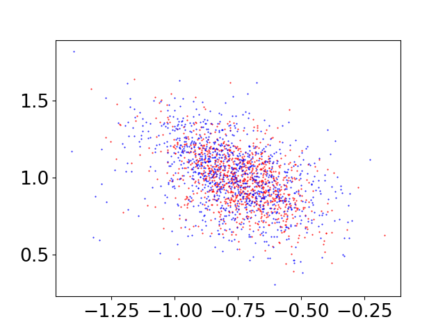
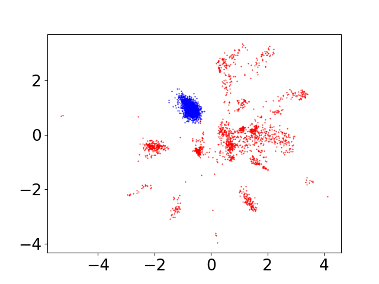
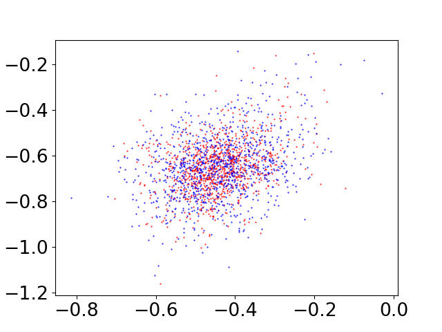
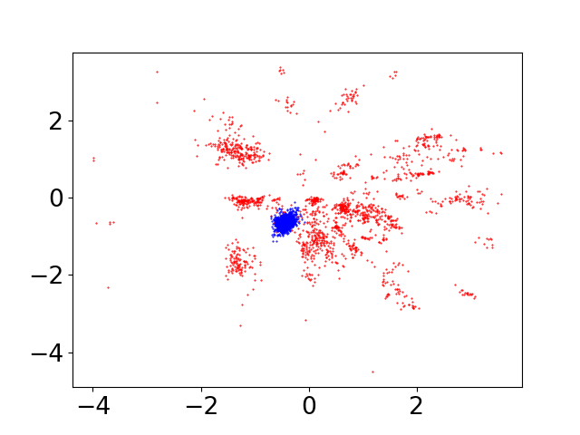
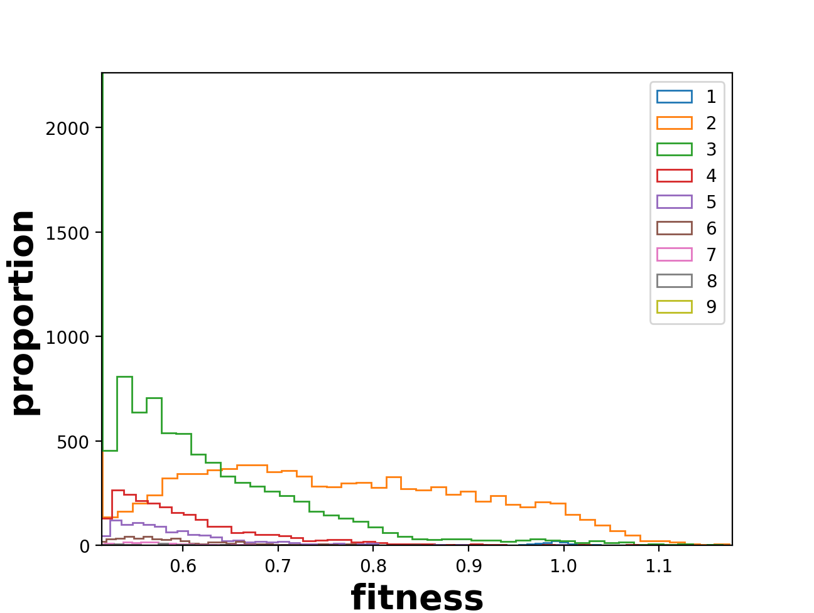
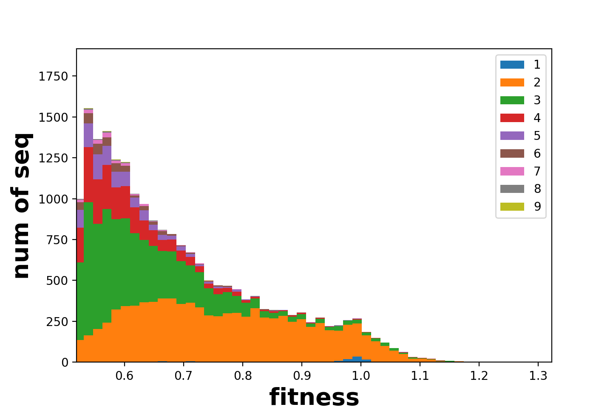
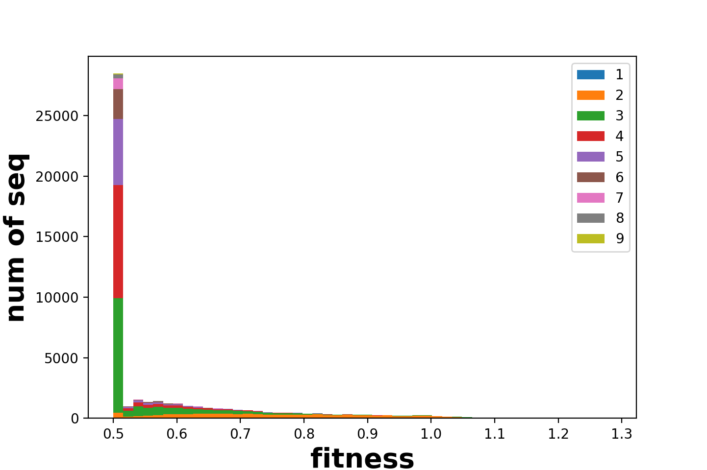
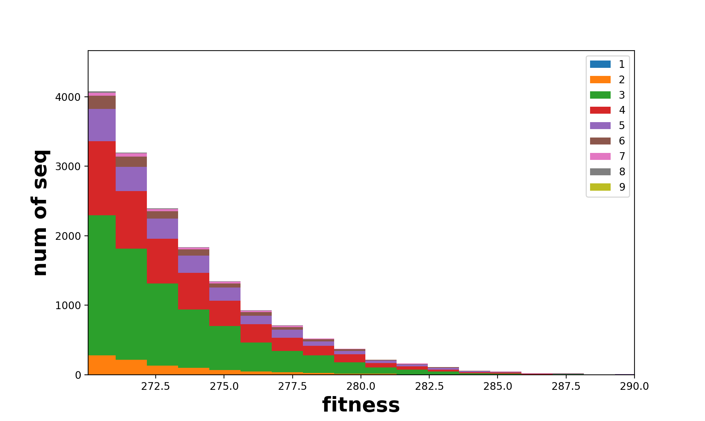
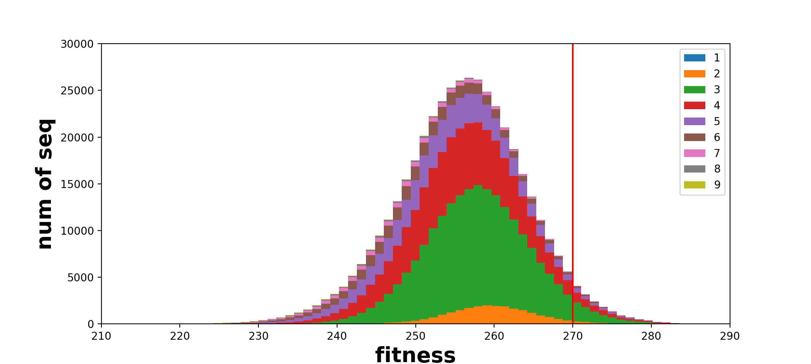

# tRNA_fitness_landscape
Jianzhi Zhang lab project

# mapping sigma - fitness

# variance test：

## comparism

## different VAE training set

average: 
mean 10-fold cross validation PCC: 0.6878 ; std: 0.0162  
PCC_train: 0.7018; std: 0.0131  
PCC_test: 0.7156; std: 0.0272  
PCC_good: 0.6004; std: 0.0423  

final training loss: 16.003093719482422;  cross validation loss: 16.007089614868164  
mean 10-fold cross validation PCC: 0.704, PCC_train: 0.712, PCC_test: 0.729, PCC_good: 0.576  
MAD_train: 0.0659, MAD_test: 0.0662, MAD_good: 0.0952  

final training loss: 16.00118637084961;  cross validation loss: 16.000320434570312  
mean 10-fold cross validation PCC: 0.687, PCC_train: 0.695, PCC_test: 0.760, PCC_good: 0.673  
MAD_train: 0.0675, MAD_test: 0.0657, MAD_good: 0.0906  

final training loss: 16.00609016418457;  cross validation loss: 16.006187438964844  
mean 10-fold cross validation PCC: 0.672, PCC_train: 0.687, PCC_test: 0.709, PCC_good: 0.592  
MAD_train: 0.0680, MAD_test: 0.0742, MAD_good: 0.1003  

final training loss: 16.004465103149414;  cross validation loss: 16.012393951416016  
mean 10-fold cross validation PCC: 0.708, PCC_train: 0.722, PCC_test: 0.700, PCC_good: 0.614  
MAD_train: 0.0646, MAD_test: 0.0726, MAD_good: 0.0992  

final training loss: 16.00389862060547;  cross validation loss: 16.009048461914062  
mean 10-fold cross validation PCC: 0.668, PCC_train: 0.693, PCC_test: 0.680, PCC_good: 0.547  
MAD_train: 0.0674, MAD_test: 0.0743, MAD_good: 0.1011  

### different GP training set

average: 
mean 10-fold cross validation PCC: 0.6714 ; std: 0.0183  
PCC_train: 0.6876; std: 0.0180  
PCC_test: 0.6754; std: 0.0105  
PCC_good: 0.5448; std: 0.0357  

mean 10-fold cross validation PCC: 0.685, PCC_train: 0.695, PCC_test: 0.670, PCC_good: 0.574  
MAD_train: 0.0670, MAD_test: 0.0676, MAD_good: 0.0897  
mean 10-fold cross validation PCC: 0.689, PCC_train: 0.710, PCC_test: 0.695, PCC_good: 0.589  
MAD_train: 0.0652, MAD_test: 0.0706, MAD_good: 0.0958  
mean 10-fold cross validation PCC: 0.674, PCC_train: 0.688, PCC_test: 0.672, PCC_good: 0.554  
MAD_train: 0.0658, MAD_test: 0.0678, MAD_good: 0.0965  
mean 10-fold cross validation PCC: 0.672, PCC_train: 0.690, PCC_test: 0.676, PCC_good: 0.497  
MAD_train: 0.0688, MAD_test: 0.0714, MAD_good: 0.1056  
mean 10-fold cross validation PCC: 0.637, PCC_train: 0.655, PCC_test: 0.664, PCC_good: 0.510  
MAD_train: 0.0746, MAD_test: 0.0689, MAD_good: 0.0917  

### same repeat：

average: 
mean 10-fold cross validation PCC: 0.6968 ; std: 0.0096  
PCC_train: 0.714; std: 0.0083  
PCC_test: 0.6812; std: 0.0333  
PCC_good: 0.572; std: 0.0354  

mean 10-fold cross validation PCC: 0.713, PCC_train: 0.729, PCC_test: 0.622, PCC_good: 0.502  
MAD_train: 0.0660, MAD_test: 0.0724, MAD_good: 0.1008  
mean 10-fold cross validation PCC: 0.697, PCC_train: 0.711, PCC_test: 0.691, PCC_good: 0.589  
MAD_train: 0.0677, MAD_test: 0.0658, MAD_good: 0.0944  
mean 10-fold cross validation PCC: 0.697, PCC_train: 0.711, PCC_test: 0.687, PCC_good: 0.583  
MAD_train: 0.0656, MAD_test: 0.0727, MAD_good: 0.0994  
mean 10-fold cross validation PCC: 0.683, PCC_train: 0.704, PCC_test: 0.725, PCC_good: 0.598  
MAD_train: 0.0663, MAD_test: 0.0701, MAD_good: 0.0947  
mean 10-fold cross validation PCC: 0.694, PCC_train: 0.715, PCC_test: 0.681, PCC_good: 0.586
MAD_train: 0.0666, MAD_test: 0.0705, MAD_good: 0.0964

# ExpData

## Latent Space Dimension
 

| dim_z                | 2      | 3      | 5      | 8      | 10     | 12     | 18     | 22     | 30     |
|----------------------|--------|--------|--------|--------|--------|--------|--------|--------|--------|
| train loss           | 16.197 | 16.020 | 16.014 | 16.000 | 16.007 | 16.003 | 16.004 | 16.001 | 16.001 |
| cross validation PCC | 0.683  | 0.663  | 0.679  | 0.643  | 0.704  | 0.719  | 0.704  | 0.658  | 0.655  |
| training PCC         | 0.687  | 0.674  | 0.685  | 0.665  | 0.714  | 0.731  | 0.716  | 0.673  | 0.686  |
| test PCC             | 0.700  | 0.690  | 0.695  | 0.580  | 0.719  | 0.702  | 0.730  | 0.677  | 0.623  |
| good PCC             | 0.576  | 0.583  | 0.598  | 0.424  | 0.604  | 0.555  | 0.626  | 0.557  | 0.510  |

<bt>

### dim_h = 10, dim_z = 30， weight_decay = 0.01，epoch = 3000
final training loss: 16.000947952270508;  cross validation loss: 16.003686904907227  
mean 10-fold cross validation PCC: 0.655, PCC_train: 0.686, PCC_test: 0.623, PCC_good: 0.510  
MAD_train: 0.0698, MAD_test: 0.0805, MAD_good: 0.1084  

### dim_h = 10, dim_z = 22， weight_decay = 0.01，epoch = 3000
final training loss: 16.001270294189453;  cross validation loss: 16.00200843811035  
mean 10-fold cross validation PCC: 0.658, PCC_train: 0.673, PCC_test: 0.677, PCC_good: 0.557  
MAD_train: 0.0709, MAD_test: 0.0693, MAD_good: 0.0933

### dim_h = 10, dim_z = 18， weight_decay = 0.01，epoch = 3000
final training loss: 16.004474639892578;  cross validation loss: 16.00810432434082  
mean 10-fold cross validation PCC: 0.704, PCC_train: 0.716, PCC_test: 0.730, PCC_good: 0.626  
MAD_train: 0.0647, MAD_test: 0.0674, MAD_good: 0.0944  

### dim_h = 10, dim_z = 12， weight_decay = 0.01，epoch = 3000
final training loss: 16.003381729125977;  cross validation loss: 16.015609741210938  
mean 10-fold cross validation PCC: 0.719, PCC_train: 0.731, PCC_test: 0.702, PCC_good: 0.555  
MAD_train: 0.0657, MAD_test: 0.0639, MAD_good: 0.0879  

### dim_h = 10, dim_z = 10， weight_decay = 0.01，epoch = 3000
final training loss: 16.007545471191406;  cross validation loss: 16.011503219604492  
mean 10-fold cross validation PCC: 0.704, PCC_train: 0.714, PCC_test: 0.719, PCC_good: 0.604  
MAD_train: 0.0659, MAD_test: 0.0686, MAD_good: 0.0981  

final training loss: 16.0082950592041;  cross validation loss: 16.008392333984375  
mean 10-fold cross validation PCC: 0.720, PCC_train: 0.735, PCC_test: 0.692, PCC_good: 0.531  
MAD_train: 0.0635, MAD_test: 0.0707, MAD_good: 0.1070  

### dim_h = 10, dim_z = 8 weight_decay = 0.01，epoch = 3000
final training loss: 16.000329971313477;  cross validation loss: 16.00382423400879  
mean 10-fold cross validation PCC: 0.643, PCC_train: 0.665, PCC_test: 0.580, PCC_good: 0.424  
MAD_train: 0.0731, MAD_test: 0.0779, MAD_good: 0.1041  

final training loss: 16.002300262451172;  cross validation loss: 16.004133224487305  
mean 10-fold cross validation PCC: 0.598, PCC_train: 0.617, PCC_test: 0.649, PCC_good: 0.583  
MAD_train: 0.0767, MAD_test: 0.0723, MAD_good: 0.0915  

final training loss: 16.00481414794922;  cross validation loss: 16.005691528320312  
mean 10-fold cross validation PCC: 0.708, PCC_train: 0.722, PCC_test: 0.625, PCC_good: 0.495  
MAD_train: 0.0667, MAD_test: 0.0712, MAD_good: 0.0992  

### dim_h = 10, dim_z = 5 weight_decay = 0.01，epoch = 3000
final training loss: 16.01358413696289;  cross validation loss: 16.012353897094727  
mean 10-fold cross validation PCC: 0.679, PCC_train: 0.685, PCC_test: 0.695, PCC_good: 0.598  
MAD_train: 0.0698, MAD_test: 0.0661, MAD_good: 0.0891  

final training loss: 16.00612449645996;  cross validation loss: 16.008193969726562  
mean 10-fold cross validation PCC: 0.707, PCC_train: 0.716, PCC_test: 0.670, PCC_good: 0.589  
MAD_train: 0.0670, MAD_test: 0.0694, MAD_good: 0.0961  

### dim_h = 10, dim_z = 3  weight_decay = 0.01，epoch = 3000
final training loss: 16.019718170166016;  cross validation loss: 16.030803680419922  
mean 10-fold cross validation PCC: 0.663, PCC_train: 0.674, PCC_test: 0.690, PCC_good: 0.583  
MAD_train: 0.0696, MAD_test: 0.0714, MAD_good: 0.0934   

## Hidden layer num

### dim_h = 50, ExpData_train20316
mean 10-fold cross validation PCC: 0.337, PCC_train: 0.340, PCC_test: 0.396, PCC_good: 0.376
MAD_train: 0.0959, MAD_test: 0.0997, MAD_good: 0.1223

### dim_h = 20, ExpData_train20316
final training loss: 16.109397888183594;  cross validation loss: 16.11008644104004
mean 10-fold cross validation PCC: 0.664, PCC_train: 0.670, PCC_test: 0.698, PCC_good: 0.540
MAD_train: 0.0689, MAD_test: 0.0640, MAD_good: 0.0907
mean 10-fold cross validation PCC: 0.590, PCC_train: 0.592, PCC_test: 0.630, PCC_good: 0.580
MAD_train: 0.0775, MAD_test: 0.0737, MAD_good: 0.0906
mean 10-fold cross validation PCC: 0.555, PCC_train: 0.564, PCC_test: 0.557, PCC_good: 0.410
MAD_train: 0.0783, MAD_test: 0.0836, MAD_good: 0.1085
mean 10-fold cross validation PCC: 0.551, PCC_train: 0.553, PCC_test: 0.623, PCC_good: 0.542
MAD_train: 0.0790, MAD_test: 0.0783, MAD_good: 0.0981

### dim_h = 10, ExpData_train20316
#### Gaossian Process training: GP_train_set_2000g

mean 10-fold cross validation PCC: 0.051, PCC_train: 0.050, PCC_test: 0.017, PCC_good: 0.017  
MAD_train: 0.1174, MAD_test: 0.1226, MAD_good: 0.1226
 

#### Gaussian Process training: GP_train_set_1000g1000b, epoch = 3000
    python batch_run/batch_run.py  \
        --input MSA/ExpData_active_train20316.pkl \
        --outdir output/ExpData_train20316_h10 \
        --num_epoch 3000 --weight_decay 0.01 \
        --dim_z 2 \
        --cutoff 0.5 \
        --cvdir output/Expdata_test1000_withgap \
        --GPtrainmsa output/GP_train_1000g1000b_withgap/seq_msa_binary.pkl \
        --GPtrainfitness MSA/GP_train_set_1000g1000b.pkl \
        --suffix 1000g1000b
##### rep1    
final training loss: 16.197772979736328;  cross validation loss: 16.194124221801758  
mean 10-fold cross validation PCC: 0.701, PCC_train: 0.703, PCC_test: 0.698, PCC_good: 0.582  
MAD_train: 0.0661, MAD_test: 0.0672, MAD_good: 0.0909  
mean 10-fold cross validation PCC: 0.683, PCC_train: 0.687, PCC_test: 0.727, PCC_good: 0.576  
MAD_train: 0.0674, MAD_test: 0.0654, MAD_good: 0.0935  
mean 10-fold cross validation PCC: 0.685, PCC_train: 0.685, PCC_test: 0.700, PCC_good: 0.608  
MAD_train: 0.0689, MAD_test: 0.0650, MAD_good: 0.0869  
mean 10-fold cross validation PCC: 0.664, PCC_train: 0.670, PCC_test: 0.698, PCC_good: 0.540  
MAD_train: 0.0689, MAD_test: 0.0640, MAD_good: 0.0907  

##### rep2
final training loss: 16.221872329711914;  cross validation loss: 16.215721130371094  
mean 10-fold cross validation PCC: 0.709, PCC_train: 0.714, PCC_test: 0.648, PCC_good: 0.549  
MAD_train: 0.0671, MAD_test: 0.0704, MAD_good: 0.0928  

#### Gaussian Process training: GP_train_set_1000g1000b, epoch = 5000
final training loss: 16.147167205810547;  cross validation loss: 16.14829444885254  
mean 10-fold cross validation PCC: 0.465, PCC_train: 0.458, PCC_test: 0.514, PCC_good: 0.446  
MAD_train: 0.1050, MAD_test: 0.1060, MAD_good: 0.1207  
mean 10-fold cross validation PCC: 0.551, PCC_train: 0.553, PCC_test: 0.623, PCC_good: 0.542  
MAD_train: 0.0790, MAD_test: 0.0783, MAD_good: 0.0981  
mean 10-fold cross validation PCC: 0.443, PCC_train: 0.553, PCC_test: 0.523, PCC_good: 0.463  
MAD_train: 0.1063, MAD_test: 0.1034, MAD_good: 0.1146  
mean 10-fold cross validation PCC: 0.497, PCC_train: 0.526, PCC_test: 0.548, PCC_good: 0.440  
MAD_train: 0.1038, MAD_test: 0.1050, MAD_good: 0.1199  

### dim_h = 5, ExpData_train20316
#### Gaossian Process training: GP_train_set_1000g1000b, epoch = 6000
final training loss: 16.2460994720459;  cross validation loss: 16.24980926513672
mean 10-fold cross validation PCC: 0.599, PCC_train: 0.601, PCC_test: 0.611, PCC_good: 0.549  
MAD_train: 0.0788, MAD_test: 0.0731, MAD_good: 0.0937  
mean 10-fold cross validation PCC: 0.598, PCC_train: 0.601, PCC_test: 0.590, PCC_good: 0.525  
MAD_train: 0.0762, MAD_test: 0.0791, MAD_good: 0.1020  
mean 10-fold cross validation PCC: 0.563, PCC_train: 0.572, PCC_test: 0.527, PCC_good: 0.449  
MAD_train: 0.0772, MAD_test: 0.0859, MAD_good: 0.1115  
mean 10-fold cross validation PCC: 0.549, PCC_train: 0.553, PCC_test: 0.634, PCC_good: 0.501 
MAD_train: 0.0811, MAD_test: 0.0683, MAD_good: 0.0892 
 
#### Gaossian Process training: GP_train_set_1000g1000b, epoch = 4000
mean 10-fold cross validation PCC: 0.657, PCC_train: 0.664, PCC_test: 0.714, PCC_good: 0.597  
MAD_train: 0.0709, MAD_test: 0.0691, MAD_good: 0.094  
mean 10-fold cross validation PCC: 0.590, PCC_train: 0.592, PCC_test: 0.630, PCC_good: 0.580  
MAD_train: 0.0790, MAD_test: 0.0783, MAD_good: 0.0981  
mean 10-fold cross validation PCC: 0.557, PCC_train: 0.560, PCC_test: 0.575, PCC_good: 0.420
MAD_train: 0.0795, MAD_test: 0.0790, MAD_good: 0.1047

## Continue traning:

Expdata_train20316_continue_from_GtRNAdb_all:  
rep1:  
final training loss: 15.922318458557129;  cross validation loss: 16.010543823242188  
mean 10-fold cross validation PCC: 0.348, PCC_train: 0.352, PCC_test: 0.428  
rep2:  
final training loss: 15.930549621582031;  cross validation loss: 15.967548370361328
mean 10-fold cross validation PCC: 0.341, PCC_train: 0.347, PCC_test: 0.443  
rep3:  
final training loss: 15.929313659667969;  cross validation loss: 15.964179992675781
mean 10-fold cross validation PCC: 0.344, PCC_train: 0.347, PCC_test: 0.444  
rep4:  
final training loss: 15.920121192932129;  cross validation loss: 15.984963417053223
mean 10-fold cross validation PCC: 0.324, PCC_train: 0.330, PCC_test: 0.412  

## Add GtRNAdb data:

### GtRNAdb_Arg_CCT_all + ExpData_0.5_1770:  
  
red: 1000good (fitness>0.5); blue: 1000bad (fitness<=0.5)  
  
red: GtRNAdb seqs; blue: ExpData   
final training loss: 29.50;  cross validation loss: ?  
mean 10-fold cross validation PCC: 0.188, PCC_train: 0.202, PCC_test: 0.243  

### GtRNAdb_Arg_CCT_all:
hidden layers channel: 10
final training loss: 39.311851501464844;  cross validation loss: 55.582393646240234
mean 10-fold cross validation PCC: 0.200, PCC_train: 0.200, PCC_test: 0.166

  
red: 1000good (fitness>0.5); blue: 1000bad (fitness<=0.5)  
  
red: GtRNAdb seqs; blue: ExpData   
final training loss: 32.959224700927734;  cross validation loss: 57.80743408203125  
mean 10-fold cross validation PCC: 0.169, PCC_train: 0.178, PCC_test: 0.240  

 
Arg - CTT:  
4899 -> exclude duplicates -> 1910  

## Training size:

Using the same VAE training set:

| subset                | 12000_d1 | 12000_d2 | 12000_d3 | 12000_d4 | 12000_d5 | 12000_0 |
|-----------------------|----------|----------|----------|----------|----------|---------|
| train loss            | 15.923   | 15.923   | 15.924   | 15.925   | 15.924   | 15.923  |
| cross validation loss | 15.976   | 15.975   | 15.974   | 15.977   | 15.975   | 15.973  |
| cross validation PCC  | 0.348    | 0.484    | 0.449    | 0.431    | 0.503    | 0.593   |
| training PCC          | 0.351    | 0.486    | 0.448    | 0.439    | 0.512    | 0.594   |
| test PCC              | 0.367    | 0.458    | 0.428    | 0.472    | 0.566    | 0.641   |

12000 VAE model

| VAE training set      | 12000_1 | 12000_2 | 12000_3 | 12000_4 | 12000_5 | 12000_0 |
|-----------------------|---------|---------|---------|---------|---------|---------|
| train loss            | 16.017  | 15.990  | 16.020  | 15.976  | 15.940  | 15.923  |
| cross validation loss | 15.969  | 15.963  | 15.969  | 15.969  | 15.973  | 15.973  |
| cross validation PCC  | 0.329   | 0.498   | 0.409   | 0.606   | 0.172   | 0.593   |
| training PCC          | 0.334   | 0.499   | 0.414   | 0.610   | 0.183   | 0.594   |
| test PCC              | 0.338   | 0.484   | 0.457   | 0.616   | 0.208   | 0.641   |

 

12000 VAE model:

| GP training set      | 1     | 2     | 3     | 4     | 5     | 0     |
|----------------------|-------|-------|-------|-------|-------|-------|
| cross validation PCC | 0.595 | 0.562 | 0.565 | 0.527 | 0.559 | 0.593 |
| training PCC         | 0.605 | 0.569 | 0.574 | 0.543 | 0.567 | 0.594 |
| test PCC             | 0.565 | 0.583 | 0.599 | 0.517 | 0.579 | 0.641 |

| training set          | 10000  | 12000  | 14000  | 16000  | 18000  | 20316  |
|-----------------------|--------|--------|--------|--------|--------|--------|
| traning loss          | 11.582 | 15.923 | 15.941 | 16.030 | 15.974 | 15.974 |
| cross validation loss | 16.250 | 15.973 | 15.977 | 15.974 | 15.977 | 15.973 |
| training PCC          | 0.249  | 0.594  | 0.377  | 0.645  | 0.546  | 0.335  |
| cros validation PCC   | 0.239  | 0.593  | 0.367  | 0.640  | 0.539  | 0.281  |
| test PCC              | 0.202  | 0.641  | 0.388  | 0.585  | 0.541  | 0.342  |

## Sample Visualization

Distribution of high fitness (>0.5) sequences

Distribution of high fitness (>0.5) sequences (stacked histogram)

Distribution of all sample (stacked histogram)

fitness = 0.5 : 27837  
fitness > 0.5 : 21316  
fitness > 0.6 : 13649  
fitness > 0.7 : 7886  
fitness > 0.8 : 4492  
fitness > 0.9 : 2365  
fitness > 1.0 : 745  

  
# Simulated Data

## latent space visualization 

1000 good sequences + 1000 bad sequences mapped to 10d latent space

## Decoder Accuracy

dim_z = 10

random error: mean = 7.371, std = 1.765, sample_size = 1000  #randomly choose 2 sequences from training set, calculate the average number of mismatch. 
predict error: mean = 3.796, std = 1.260, sample_size = 2000  
Ttest_indResult(statistic=-57.15380896418932, pvalue=0.0)
  

predict error for good sequences: mean = 3.501, std = 1.170, sample_size = 1000  
predict error for bad sequences: mean = 4.091, std = 1.277, sample_size = 1000  
Ttest_indResult(statistic=-10.76520151991619, pvalue=2.638240089929478e-26)

## Encoder Sigma

training subset: 1000g1000b
dim_z = 10
sigma^2 = \[0.64629585, 0.99972963, 0.99992007, 0.99569345, 0.9600127, 0.99940825, 0.99990076, 0.9999758 , 0.9998213 , 0.9997909 \]

training set:
dim_z =10
sigma^2 = \[0.6439823 , 0.99970835, 0.9999718 , 0.99553096, 0.9604204, 0.9993257 , 0.9998293 , 1.0000199 , 0.9998647 , 0.9997776 \]

testset:
dim_z = 2
sigma^2 = \[0.63487, 0.8513085\]

training set:
dim_z = 2
sigma^2 = \[0.73748964, 0.84963286\]

## gaussian process

size_z = 10, 1000 good (training set) + 1000 bad:

mean 10-fold cross validation PCC: 0.747

PCC_train: 0.824, PCC_test: 0.670

MAD_train: 0.1, MAD_test: 0.1

size_z = 10, 2000 good in training set:

mean 10-fold cross validation PCC: 0.572

PCC_train: 0.653, PCC_test: 0.467

MAD_train: 0.1, MAD_test: 0.1

size_z = 2, 1000 good in test set:

mean 10-fold cross validation PCC: 0.575

PCC_train: 0.691, PCC_test: 0.502

MAD_train: 0.1, MAD_test: 0.1

| mutation num             | 1      | 2      | 3      | 4      | 5      | 6      | 7      | 8     | 9     |
|--------------------------|--------|--------|--------|--------|--------|--------|--------|-------|-------|
| good                     | 5      | 898    | 7471   | 4216   | 1960   | 775    | 243    | 57    | 12    |
| total                    | 216    | 23004  | 187997 | 119937 | 64999  | 30000  | 11000  | 3500  | 1000  |
| good ratio (fitness>270) | 0.0231 | 0.0390 | 0.0397 | 0.0351 | 0.0301 | 0.0258 | 0.0221 | 0.016 | 0.012 |

## Sample Visualization

Distribution of high fitness (>270) sequences

Distribution of all sample (stacked histogram)

Distribution of all sample
