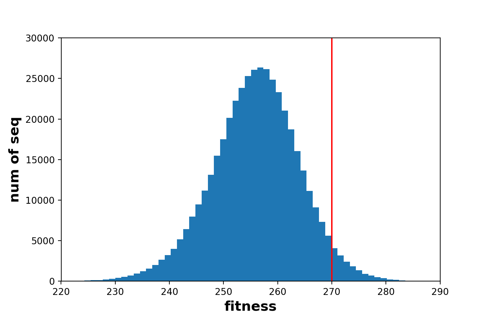

# tRNA_fitness_landscape
Jianzhi Zhang lab project

# ExpData

## Sample Visualization

Distribution of high fitness (>0.5) sequences

Distribution of high fitness (>0.5) sequences (stacked histogram)

Distribution of all sample (stacked histogram)

# Simulated Data

## latent space visualization 

1000 good sequences + 1000 bad sequences mapped to 10d latent space

## Decoder Accuracy

dim_z = 10

random error: mean = 7.371, std = 1.765, sample_size = 1000  #randomly choose 2 sequences from training set, calculate the average number of mismatch. 
predict error: mean = 3.796, std = 1.260, sample_size = 2000  
Ttest_indResult(statistic=-57.15380896418932, pvalue=0.0)
  

predict error for good sequences: mean = 3.501, std = 1.170, sample_size = 1000  
predict error for bad sequences: mean = 4.091, std = 1.277, sample_size = 1000  
Ttest_indResult(statistic=-10.76520151991619, pvalue=2.638240089929478e-26)

## Encoder Sigma

training subset: 1000g1000b
dim_z = 10
sigma^2 = \[0.64629585, 0.99972963, 0.99992007, 0.99569345, 0.9600127, 0.99940825, 0.99990076, 0.9999758 , 0.9998213 , 0.9997909 \]

training set:
dim_z =10
sigma^2 = \[0.6439823 , 0.99970835, 0.9999718 , 0.99553096, 0.9604204, 0.9993257 , 0.9998293 , 1.0000199 , 0.9998647 , 0.9997776 \]

testset:
dim_z = 2
sigma^2 = \[0.63487, 0.8513085\]

training set:
dim_z = 2
sigma^2 = \[0.73748964, 0.84963286\]

## gaussian process

size_z = 10, 1000 good (training set) + 1000 bad:

mean 10-fold cross validation PCC: 0.747

PCC_train: 0.824, PCC_test: 0.670

MAD_train: 0.1, MAD_test: 0.1

size_z = 10, 2000 good in training set:

mean 10-fold cross validation PCC: 0.572

PCC_train: 0.653, PCC_test: 0.467

MAD_train: 0.1, MAD_test: 0.1

size_z = 2, 1000 good in test set:

mean 10-fold cross validation PCC: 0.575

PCC_train: 0.691, PCC_test: 0.502

MAD_train: 0.1, MAD_test: 0.1

| mutation num             | 1      | 2      | 3      | 4      | 5      | 6      | 7      | 8     | 9     |
|--------------------------|--------|--------|--------|--------|--------|--------|--------|-------|-------|
| good                     | 5      | 898    | 7471   | 4216   | 1960   | 775    | 243    | 57    | 12    |
| total                    | 216    | 23004  | 187997 | 119937 | 64999  | 30000  | 11000  | 3500  | 1000  |
| good ratio (fitness>270) | 0.0231 | 0.0390 | 0.0397 | 0.0351 | 0.0301 | 0.0258 | 0.0221 | 0.016 | 0.012 |

## Sample Visualization

Distribution of high fitness (>270) sequences

Distribution of all sample (stacked histogram)

Distribution of all sample
